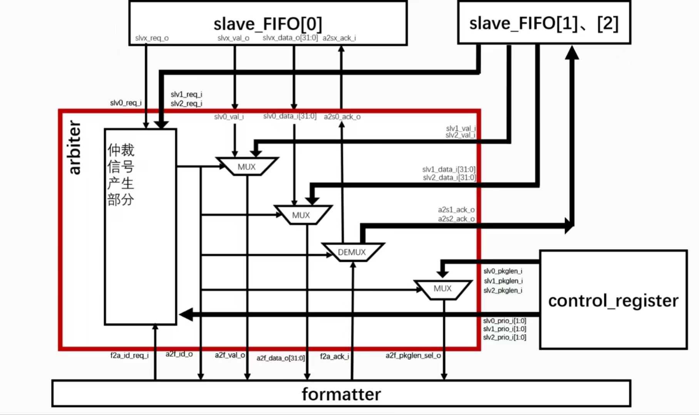
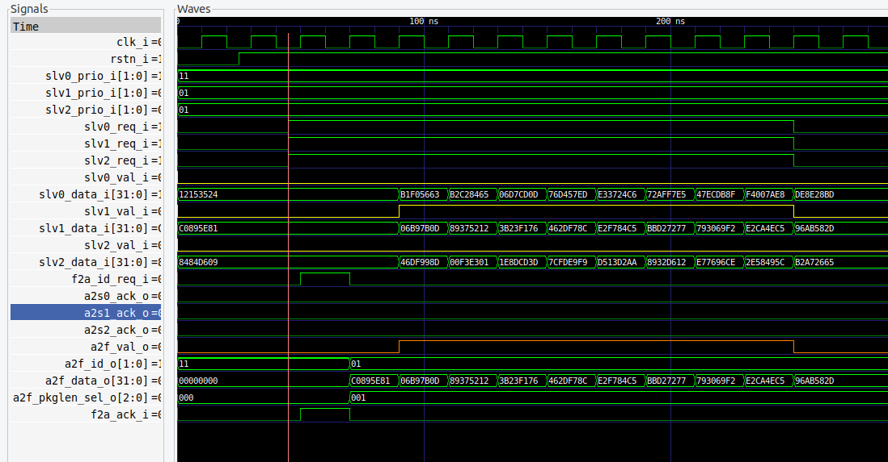

## arbiter仲裁器
#### 设计结构

#### 测试波形

#### 信号时序描述
&emsp;&emsp;1.首先要有输入**slv0/1/2_req_i**的salve请求发送信号(h)，代表slave当前至少有一个包等待发送；这是因为优先级分配电路的输出a2f_id_o代表当前就绪的最优先通道，如果没用通道最优先，a2f_id_o就会等于11，通过多路选择控制输出信号为0

&emsp;&emsp;2.slv0/1/2就绪之后，需要等待**f2a_id_req_i**信号出现至少持续一个时钟周期，这时优先级分配电路就会结合就绪信号slv0/1/2_req_i找到优先通道a2f_id_o(需要一个时钟周期)，将输入输出和优先通道**接通**

&emsp;&emsp;3.**接通**之后，需要等待f2a_ack_i信号,这个信号时formatter下达的，由于接通了，直连到选通slave的a2sx_ack_i。当这个上级请求下级发送信号出现时（h持续一个周期),slave就会传递数据，通过slv
_vali信号高电平覆盖的数据（包络）来识别数据帧。

&emsp;&emsp;4.**结束**结束之后，保持当前通道连接，不切换到别的通道。当新的**f2a_id_req_i**出现自然会完成重新优先级分配和通道切换。

## !!!存疑的问题
**f2a_id_req_i**信号产生的问题，谁来告诉formatter什么时候发送这个信号，握手机制需要仔细核对