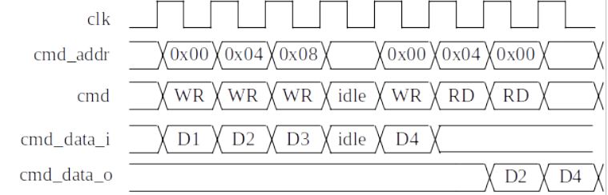
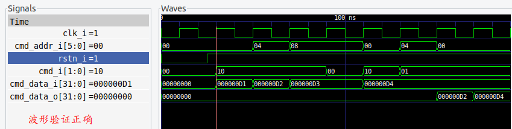

## control_register 控制寄存器
#### 参考波形

#### 测试波形

其中`cmd_i=01`代表`RD`，`cmd_i=10`代表`WR`，`cmd_i=00`或`11`代表`idle`(这块内容设计文档中没有给出，因此自己指定为以上内容)
***
**存在问题**：在control_register.v文档中，请用!!!进行检索

**注意**：读写的执行都是在给出读写命令和相关数据的下一时钟周期才实现（这时符合参考波形的）
