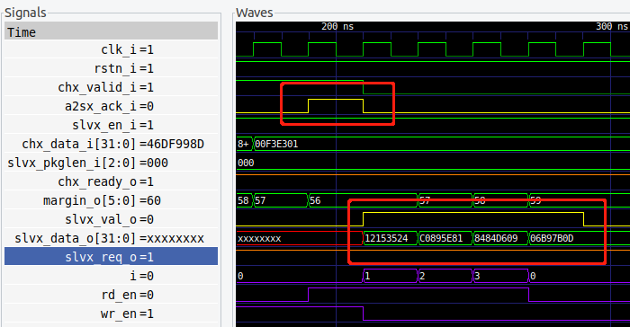

## formatter 整形器（MCDF输出部分）
#### ★时序关系
推拉式的时序关系

当前发送任务完毕时（即当前没用发送时）

先朝下看，看arbiter有没有发送请求，跟arbiter握手

>formatter发送结束之后，就将询问信号fmt_id_req置高，这导致arbiter刷新优先级然后选通相应通道（也可能所有通道都没就绪，就选通空通道）**但是可以根据arbiter输入的优先通道信号来知道有没有就绪，如果时11空通道就表示没用就绪（这是一个隐藏的握手信号）**

>因此置高完fmt_id_req就等待有效通道不是11就行了（**这里注意信号不要重叠，先让优先级刷新完再判断**）

>不是11代表arbiter就绪，可以发送。这时候已经选通了，相当于直连slave，因此slave就等待一个ack信号就可以发送了。现在下面已经就绪，我们向上握手。

再朝上看，等待外部传入允许发送的信号grant，但在这之前我们要告诉上级，下级已经就绪
>如前所述，当有效通道不是11，则fmt_req置高，否则继续等待直到不是11.

>置高之后，等待外部允许发送信号fmt_grant,当fmt_grant（**ack可能要和fmt_grant为同一个信号(wire相连)，不然不满足时序关系**）为高时，在下一个周期
置低fmt_req
fmt_start输出一个时钟周期的高电平脉冲
fmt_data开始送出第一个数据
[**注意**]：这里有严格的时序关系，就是grant为高的下个时钟周期就要开始发送第一个数据了，这就要求grant直连的信号slave的ack也满足这样的时序关系，具**体而言就是slave中的数据在ack之后下一个时钟周期就要发送，valid信号同理**
具体做法就是采用了一些简单的**波形变换**（因为之前的波形不满足，我又修改了一下，现在slave中波形就满足了时序关系，如下图黄色波形所示）

结束
发送完毕
>fmt_id_req置高开始下一次循环